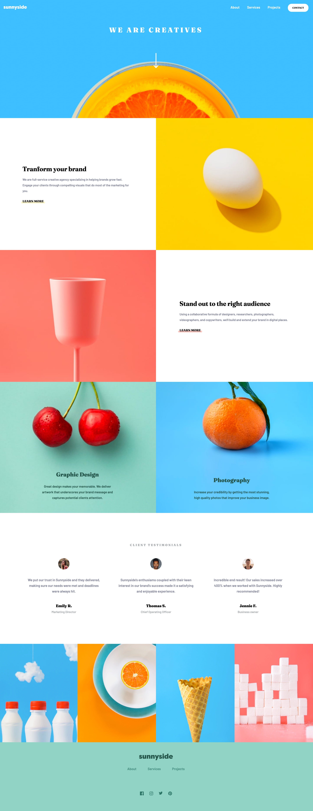

# Sunnyside agency landing page

This is a solution to the [Sunnyside agency landing page challenge on Frontend Mentor](https://www.frontendmentor.io/challenges/sunnyside-agency-landing-page-7yVs3B6ef). Frontend Mentor challenges help you improve your coding skills by building realistic projects.

## Table of contents

- [Overview](#overview)
  - [The challenge](#the-challenge)
  - [Screenshot](#screenshot)
  - [Links](#links)
- [My process](#my-process)
  - [Built with](#built-with)
  - [What I learned](#what-i-learned)
- [Author](#author)

## Overview

### The challenge

Users should be able to:

- View the optimal layout for the site depending on their device's screen size
- See hover states for all interactive elements on the page

### Screenshot

### Links

- [Solution URL](https://www.frontendmentor.io/solutions/sunnyside-challenge-with-vite-vanillajs-FwGKbg6YJU)
- [Live Site URL](https://nicolasmontoya.github.io/sunnyside-fm-challenge/)

## My process

### Built with

- Semantic HTML5 markup
- CSS custom properties
- Flexbox
- CSS Grid
- Vanilla JavaScript

### What I learned

During this challenge, I have learned about Vite and its integration with vanilla JS projects. I also sharpen my frontend skills with HTML5 and CSS

## Author

- Github - [NicolasMontoya](https://github.com/uzoway)
- Frontend Mentor - [NicolasMontoya](https://www.frontendmentor.io/profile/NicolasMontoya)
